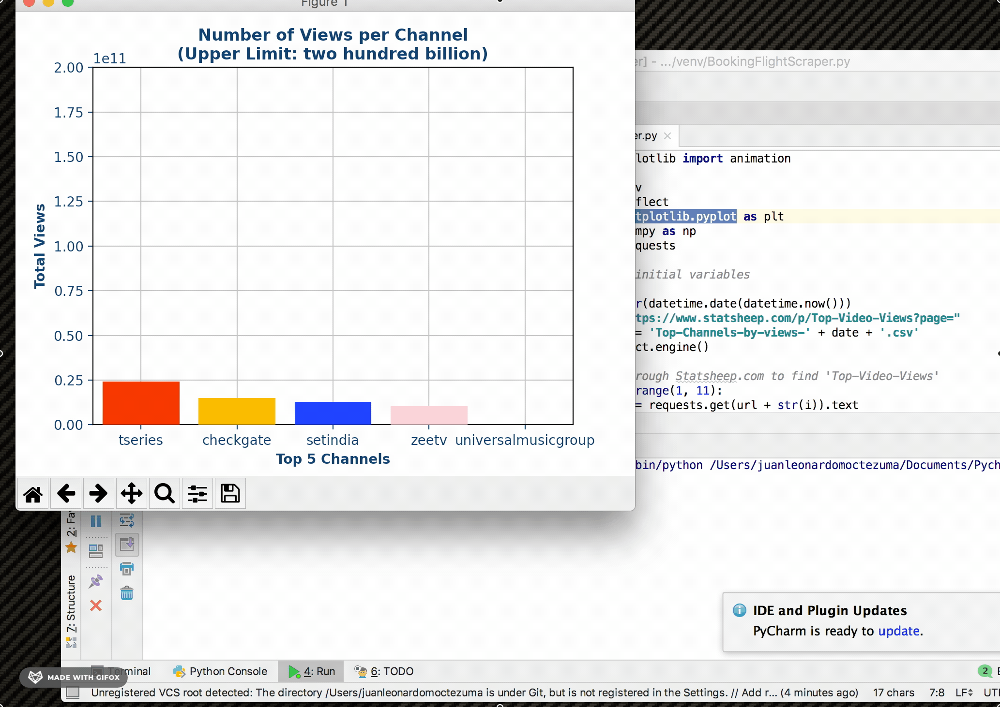
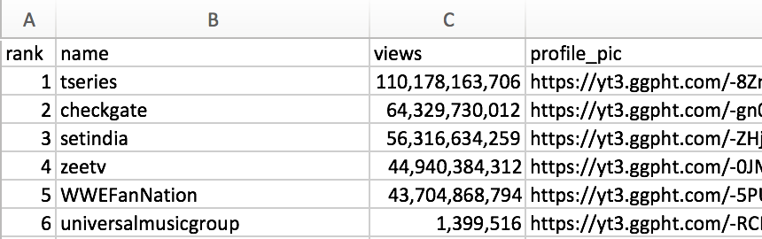

# Statsheep Web Scraper

### Introduction
The purpose of this Python web scraper is to extract data from Statsheep.com, and generate a 
csv file containing a list of the top 1000 most-viewed Youtube channels. In addition, 
this script generates a bar chart with the top 5 Youtube channels (by Views) out of those 
1000 channels / YouTubers. The csv document and bar chart update whenever Statsheep does. 

### Project GIF

### Directory Tree
N/A (project consists of one file: Statsheep_scraper.py)

### What are the outputs?
1. CSV: Top-Channels-by-views-YYYY-MM-DD.csv\
   

2. Chart: Top 5 Channels by Views\
   

### Technologies
1. Python 3 (packages):
   * bs4 / BeautifulSoup
   * Matplotlib
   * Matplotlib.pyplot
   * Numpy
